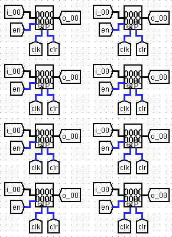
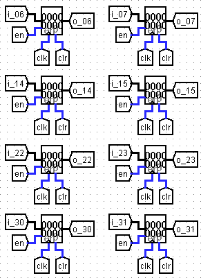
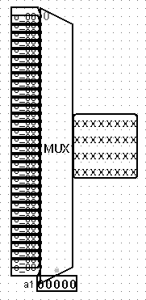
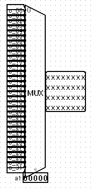

# Logisim-Automate

Automately generate Logisim circuits with repetition structures

自动化生成带有重复结构的 Logisim 电路

## 问题背景

在 Logisim 中，如果需要生成一个带有重复结构的电路，如寄存器矩阵、内存矩阵等，需要手动添加最小单元并翻倍复制粘贴 $\log_2n$ 次。这一过程相对简单。但涉及隧道标签的重命名时，就需要大量的繁琐操作。

一些教程给出的方法，使用 Python 脚本根据最小单元样例直接生成电路，可以一并解决命名问题，但这种方法需要计算元件位置，略显繁琐。且当最小单元包含较多元件甚至含有线路时，这种方法就更不方便了。Logisim 原版生成的文件中，元件顺序是不确定的，影响我们分析位置信息，让问题雪上加霜。

## 解决方案

为此，我编写了一个 Python 脚本。在已经用 Logisim 复制完成重复结构的基础上，它可以根据元件的位置信息，自动重命名隧道标签。此外，即使不需要重命名，它的前半部分代码也可以将元件按照位置信息排序，使得生成的文件更加清晰，方便其他自动化操作。

此方法同时也简化了工作流，不再需要在 Logisim — Python — XML 之间来回切换，只需要一次性搭好所有电路，预命名好需要批量重命名的隧道并按照上下次序摆放即可。

## 使用方法

1. 在 Logisim 中，复制完成含有重复结构的基础电路，将待重命名的标签设置为 `xx_00` 的格式，其中 `xx` 为标签前缀，可以改为其他字符；且可有多种前缀，后续可以分组增量命名。
2. 打开 `sort-rename.ipynb` 或 `sort-rename.py`，按照注释修改参数及排序和重命名的方式，运行即可。注意，请务必修改 `file_dir` 为你要自动化的文件名。
3. 生成的文件为 `renamed.circ`，可以直接用 Logisim 打开。

## 效果展示

以 `sample.circ` 为例，展示了重命名前后的效果。

重命名前 | 重命名后
:---: | :---:
 | 
 | 